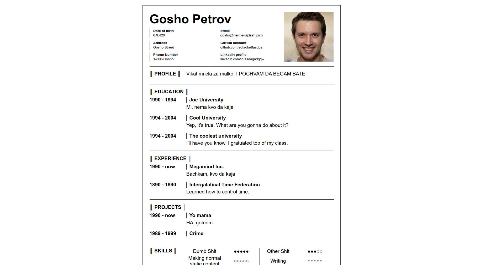
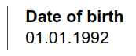
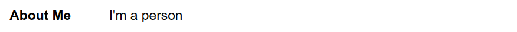
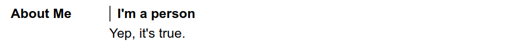
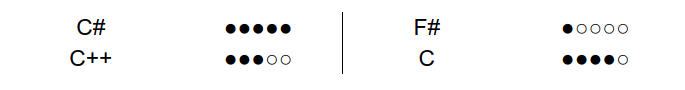

This is a small template for making resumes. Edit the HTML and CSS with your values and then print it to a PDF file **(WITH AN A4 SIZE OF PAPER)**. What you see should be the same as what you get after printing (open an issue if you've found a discrpetancy!).


*The sample profile picture is taken from [thispersondoesnotexist.com](https://thispersondoesnotexist.com/)*

# CSS classes

In the following sections you'll get explanations and examples about the main styling classes.

## stacked-info

It's used for the content, beside your profile picture. It just shows text with a line to left. You can add a bold title by wraping the title text in `<b>` and then adding a line break (`<br>`). It's usually inside an `info` class.

Sample usage:
```html
<div class="stacked-info">
	<b>Date of birth</b><br>
	01.01.1992
</div>
```


## card

Cards are the main type of element. Each card is as wide as it can be and it contains it's title to the left, which is bold, and it's content to the right.

Sample usage:
```html
<div class="card">
	<div class="card-title">
		About Me
	</div>
	<div class="card-content">
		I'm a person
	</div>
</div>
```


### card-sub-title

You can also add a special title inside the content part of a card. It will be bold and have a line to the left of it (similar to [stacked-info](#stacked-info)). The actual contents should be below it.

Sample usage:
```html
<div class="card">
	<div class="card-title">
		About Me
	</div>
	<div class="card-content">
		<div class="card-sub-title">
			I'm a person
		</div>
		Yep, it's true.
	</div>
</div>
```


## ratings

Only tables **must** have the `ratings` class. It's a special type of table, where you're meant to add a title and then add some sort of text that indicates how good you are at it. Every two columns are separated by a border. All columns have the same width.

Sample usage:
```html
<table class="ratings">
	<tr>
		<td>C#</td>
		<td>●●●●●</td>
		<td>F#</td>
		<td>●○○○○</td>
	</tr>
	<tr>
		<td>C++</td>
		<td>●●●○○</td>
		<td>C</td>
		<td>●●●●○</td>
	</tr>
</table>
```


**Note:** obviously, you can use whatever text you want for the rating values, I just like the circles

# Special styling

Some stuff have some caveats to how and when they are styled.

## hr

The `<hr>` element is usually styled as a gray line, but when it's directly inside the content class (meaning when it's between main sectons), it's styled as a color, close to black.

## page

The `page` class, in which each page is stored, centers it in the screen, but while printing there is a specific margin.
